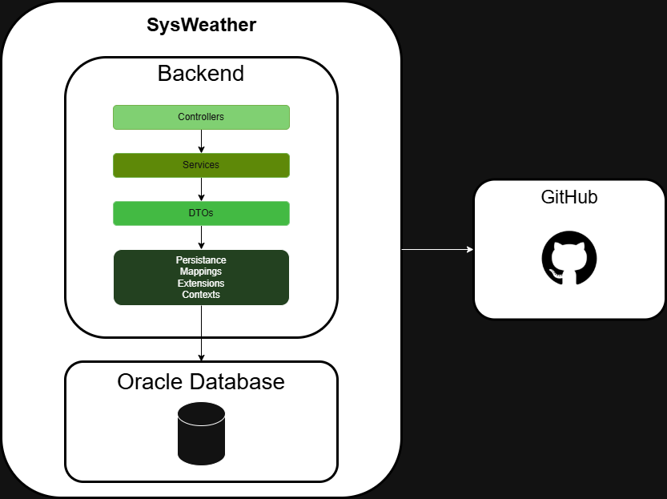

# 🚀 SysWeather

**SysWeather** é uma aplicação desenvolvida com **ASP.NET Core Web API** para auxiliar na prevenção de eventos climáticos extremos, oferecendo filtros personalizados, paginação e ordenação de dados.

## 📌 Índice

- [🧾 Sobre o Projeto](#-sobre-o-projeto)
- [⚙️ Tecnologias Utilizadas](#-tecnologias-utilizadas)
- [🧪 Como Executar](#-como-executar)
- [📌 Endpoints da API](#-endpoints-da-api)
- [✅ Funcionalidades](#-funcionalidades)
- [📈 Diagrama da Solução](#-diagrama-da-solucao)
- [🗂 Estrutura do Projeto](#-estrutura-do-projeto)
- [🗃️ Modelo de Entidades](#-modelo-de-entidades)
- [📚 Enums das Entidades](#-enums-das-entidades)
- [👨‍💻 Nossa equipe](#-nossa-equipe)

---

## 🧾 Sobre o Projeto

### SysWeather – Sistema de Monitoramento de Eventos Climáticos Extremos

**Desafio:**  
Desenvolvido para o desafio “Eventos Extremos” da FIAP, o SysWeather é uma solução tecnológica inovadora para prevenção, detecção e monitoramento de desastres naturais, como enchentes, tempestades e alagamentos urbanos. O sistema integra tecnologias modernas, incluindo IoT, aplicativo mobile, banco de dados relacional, API RESTful, Docker e arquitetura empresarial, com o objetivo de proteger vidas e otimizar a resposta emergencial em áreas de risco.

**Objetivos:**  
- Monitorar condições meteorológicas em tempo real por meio de sensores IoT.  
- Emitir alertas de risco para usuários cadastrados.  
- Exibir informações sobre cidades afetadas, status dos eventos e recomendações de ações.  
- Permitir o gerenciamento remoto e seguro das informações por equipes técnicas.

**Público-Alvo:**  
Cidadãos de áreas de risco, gestores públicos municipais, Defesa Civil, agentes de campo e voluntários envolvidos na resposta a desastres ambientais.

**Impactos Esperados:**  
- Redução do tempo de resposta a eventos climáticos extremos.  
- Maior conscientização da população sobre riscos ambientais.  
- Criação de uma base de dados climática para análises futuras.  
- Escalabilidade para outras regiões e tipos de desastres.

---

## ⚙️ Tecnologias Utilizadas

- C#
- .NET 6 ou superior 
- ASP.NET Core Web API
- Entity Framework Core (EF Core)
- Oracle Database
- Oracle.EntityFrameworkCore
- Swagger/OpenAPI

---

## 🧪 Como Executar

### Ambiente

- .NET SDK 7.0 ou superior
- Oracle Database
- Visual Studio 2022+ ou Visual Studio Code
- dotnet ef
- Postman ou outro programa de testes de API.

### Pacotes NuGet importantes

- Microsoft.EntityFrameworkCore
- Microsoft.EntityFrameworkCore.Tools
- Microsoft.EntityFrameworkCore.Design
- Oracle.EntityFrameworkCore

### Passos

```bash
# Clone o repositório
git clone https://github.com/guurangel/SysWeatherCSharp.git

# Acesse a pasta do projeto
cd SysWeatherCSharpp

# Configure a string de conexão Oracle
"ConnectionStrings": {
  "Oracle": "User Id=SEU_USUARIO;Password=SUA_SENHA;Data Source=SEU_HOST:PORTA/SEU_SERVICE_NAME"
}

# Gerar e aplicar as migrations
dotnet ef migrations add CreateDatabase --context SysWeatherDbContext
dotnet ef database update --context SysWeatherDbContext

# Executar a aplicação
dotnet run
```

A API estará disponível em:  
📍 `http://localhost:5147`

Acesse o Swagger para testar os endpoints:  
📘 `http://localhost:5147/swagger-ui.html`

---

## 📌 Endpoints da API

### 🏙️ Municípios

- `GET /api/municipio` — Lista municípios com filtros
- `POST /api/municipio` — Cadastra um novo município
- `GET /api/municipio/{id}` — Busca município por ID
- `PUT /api/municipio/{id}` — Atualiza dados de um município
- `DELETE /api/municipio/{id}` — Remove um município

**Filtros disponíveis (como parâmetros da URL):**

- `nome` — nome do município (parcial ou completo)
- `estado` — estado (UF)
- `regiao` — região do país
- `clima` — clima do município
- `numeroHabitantes`, `numeroHabitantesMin`, `numeroHabitantesMax` — número exato ou intervalo de habitantes
- `areaKm2`, `areaKm2Min`, `areaKm2Max` — área total em km², exata ou intervalo
- `altitude`, `altitudeMin`, `altitudeMax` — altitude, exata ou intervalo

---

### 👥 Usuários

- `GET /api/usuario` — Lista usuários com filtros
- `POST /api/usuario` — Cadastra um novo usuário
- `GET /api/usuario/{id}` — Busca usuário por ID
- `PUT /api/usuario/{id}` — Atualiza dados de um usuário
- `DELETE /api/usuario/{id}` — Remove um usuário

**Filtros disponíveis (como parâmetros da URL):**

- `municipioNome` — nome do município associado ao usuário
- `nome` — nome do usuário
- `email` — email do usuário
- `cpf` — cpf do usuário
- `dataCadastro`, `dataCadastroInicio`, `dataCadastroFim` — data exata ou intervalo de cadastro
- `dataNascimento`, `dataNascimentoInicio`, `dataNascimentoFim` — data exata ou intervalo de nascimento

---

### ⚠️ Ocorrências

- `GET /api/ocorrencia` — Lista ocorrências registradas com paginação
- `POST /api/ocorrencia` — Cadastra uma nova ocorrência
- `GET /api/ocorrencia/{id}` — Busca ocorrência por ID

**Filtros disponíveis (como parâmetros da URL):**

- `municipioNome` — nome do município associado a ocorrência
- `nivelRisco` — nível de risco da ocorrência
- `tipo` — tipo de risco da ocorrência
- `dataOcorrencia`, `dataOcorrenciaInicio`, `dataOcorrenciaFim` — data exata ou intervalo
  
---

### 🔔 Notificações

- `GET /api/notificacao` — Lista todas as notificações de eventos climáticos
- `GET /api/notificacao/{id}` — Lista as notificações por id

---

## ✅ Funcionalidades

- :file_cabinet: Utilizaçao de Migrations para criação da estrutura do banco de dados
- 📖 Validações detalhadas com mensagens amigáveis
- 📊 Documentação interativa via Swagger
- 📦 Paginação e ordenação nos endpoints
- 🔍 Filtros dinâmicos

---

## 📈 Diagrama da Solução



**Descrição:** Diagrama da solução SysWeather para a disciplina de Advanced Business Development With .NET.

---

## 🗂 Estrutura do Projeto

```plaintext
📁 SysWeatherCSharpp/
├── 📁 Controllers/
│   ├── 📄 MunicipioController.cs
│   ├── 📄 NotificacaoController.cs
│   ├── 📄 OcorrenciaController.cs
│   └── 📄 UsuarioController.cs
│
├── 📁 Diagram/
│   ├── 📄 SysWeather.drawio.png
│
├── 📁 DTO/
│   ├── 📁 Request/
│   │   ├── 📄 AtualizarUsuarioRequest.cs
│   │   ├── 📄 MunicipioFiltersRequest.cs
│   │   ├── 📄 MunicipioRequest.cs
│   │   ├── 📄 OcorrenciaFiltersRequest.cs
│   │   ├── 📄 OcorrenciaRequest.cs
│   │   ├── 📄 UsuarioFiltersRequest.cs
│   │   └── 📄 UsuarioRequest.cs
│   │
│   └── 📁 Response/
│       ├── 📄 MunicipioResponse.cs
│       ├── 📄 NotificacaoOcorrenciaResponse.cs
│       ├── 📄 OcorrenciaResponse.cs
│       └── 📄 UsuarioResponse.cs
│
├── 📁 Infrastructure/
│   ├── 📁 Contexts/
│   │   └── 📄 SysWeatherDbContext.cs
│   │
│   ├── 📁 Extensions/
│   │   ├── 📄 MunicipioFiltersExtensions.cs
│   │   ├── 📄 OcorrenciaFiltersExtensions.cs
│   │   └── 📄 UsuarioFiltersExtensions.cs
│   │
│   ├── 📁 Mappings/
│   │   ├── 📄 MunicipioMapping.cs
│   │   ├── 📄 NotificacaoOcorrenciaMapping.cs
│   │   ├── 📄 OcorrenciaMapping.cs
│   │   └── 📄 UsuarioMapping.cs
│   │
│   └── 📁 Persistence/
│       ├── 📁 Enums/
│       │   ├── 📄 Clima.cs
│       │   ├── 📄 Estados.cs
│       │   ├── 📄 NivelRisco.cs
│       │   ├── 📄 Regiao.cs
│       │   └── 📄 TipoOcorrencia.cs
│       │
│       ├── 📄 Municipio.cs
│       ├── 📄 NotificacaoOcorrencia.cs
│       ├── 📄 Ocorrencia.cs
│       └── 📄 Usuario.cs
│
├── 📁 Properties/
│   └── 📄 launchSettings.json
│
├── 📁 Services/
│   ├── 📄 MunicipioService.cs
│   ├── 📄 OcorrenciaService.cs
│   └── 📄 UsuarioService.cs
│
├── 📄 Program.cs
├── 📄 SysWeatherCSharpp.csproj
├── 📄 SysWeatherCSharpp.http
├── 📄 appsettings.Development.json
├── 📄 appsettings.json
├── 📄 .gitattributes
├── 📄 .gitignore
├── 📄 README.md
└── 📄 SysWeatherCSharpp.sln
```

**Descrição:** estrutura do projeto segue uma arquitetura em camadas, organizada para garantir separação de responsabilidades. Os diretórios incluem configurações, controllers, services, Infrastructure, DTOs, recursos estáticos, e o README.

---

## 🗃️ Modelo de Entidades

### Municipio

```
Id: Guid
Nome: String
Estado: Estado
NumeroHabitantes: Integer
Clima: Clima
Regiao: Regiao
Altitude: Double
AreaKm2: Double
Usuarios: List<Usuario>
Ocorrencias: List<Ocorrencia>
```

**Descrição:** Representa uma cidade monitorada pelo sistema. Contém dados geográficos e demográficos, além de listas com os usuários residentes e ocorrências registradas na localidade.

### Usuario

```
Id: Guid
Nome: String
Email: String
Senha: String
Cpf: String
DataNascimento: DateTime
DataCadastro: DateTime
MunicipioId: Guid
Municipio: Municipio
Notificacoes: List<NotificacaoOcorrencia>
```

**Descrição:** Representa um cidadão cadastrado na plataforma. Contém informações pessoais, vínculo com um município e histórico de notificações recebidas relacionadas a eventos climáticos.

### Ocorrencia
```
Id: Guid
Descricao: String
Tipo: TipoOcorrencia
NivelRisco: NivelRisco
DataOcorrencia: DateTime
MunicipioId: Guid
Municipio: Municipio
```

**Descrição:** Representa um evento climático extremo (como enchente, tempestade etc.) ocorrido em um município específico. Possui tipo, nível de risco e data de ocorrência.

### NotificacaoOcorrencia
```
Id: Guid
Mensagem: String
DataEnvio: DateTime
UsuarioId: Guid
Usuario: Usuario
OcorrenciaId: Guid
Ocorrencia: Ocorrencia
```

**Descrição:** Representa uma notificação enviada a um usuário sobre uma ocorrência climática. Inclui a mensagem, data de envio e os vínculos com o usuário e a ocorrência correspondente.

---

## 📚 Enums das Entidades

### `Estado`
Enum que representa os estados brasileiros.

```
AC, AL, AP, AM, BA, CE, DF, ES, GO, MA,
MT, MS, MG, PA, PB, PR, PE, PI, RJ, RN,
RS, RO, RR, SC, SP, SE, TO
```

### `Clima`
Enum que representa os climas.

```
TROPICAL, SEMI_ARIDO,
EQUATORIAL, SUBTROPICAL,
TEMPERADO, ÁRIDO,
MEDITERRÂNEO, CONTINENTAL
```

### `Regiao`
Enum que representa as regiões geográficas do Brasil.

```
NORTE, NORDESTE, CENTRO_OESTE, SUDESTE, SUL
```

### `TipoOcorrencia`
Enum que classifica o tipo de evento climático monitorado.

```java
CHUVA_FORTE, DESLIZAMENTO,
VENTO_FORTE, GRANIZO,
SECA, INUNDACAO
```

### `NivelRisco`
Enum que define o grau de severidade de uma ocorrência climática.

```
BAIXO, MEDIO, ALTO
```

---

## 👨‍💻 Nossa equipe

**Gustavo Rangel**  
💼 Estudante de Análise e Desenvolvimento de Sistemas na FIAP  
🔗 [linkedin.com/in/gustavoorangel](https://www.linkedin.com/in/gustavoorangel)

**David Rapeckman**  
💼 Estudante de Análise e Desenvolvimento de Sistemas na FIAP  
🔗 [linkedin.com/in/davidrapeckman](https://www.linkedin.com/in/davidrapeckman)

**Luis Felippe Morais**  
💼 Estudante de Análise e Desenvolvimento de Sistemas na FIAP  
🔗 [linkedin.com/in/luis-felippe-morais-das-neves-16219b2b9](https://www.linkedin.com/in/luis-felippe-morais-das-neves-16219b2b9)
